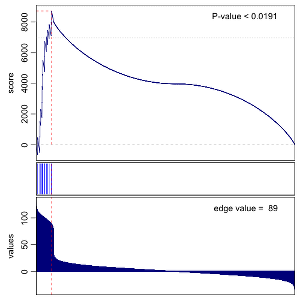
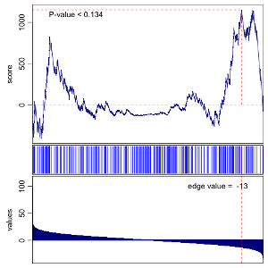

# Lightweight Iterative Gene set Enrichment in R (LIGER)

**[See vignette for tutorial ☞ Gene Set Enrichment Analysis with LIGER](vignettes/gsea.pdf)**

Gene Set Enrichment Analysis (GSEA) is a computational method that determines whether an a priori defined set of genes shows statistically significant, concordant differences between two biological states. The original algorithm is detailed in [Subramanian, Tamayo, et al.](http://www.pnas.org/content/102/43/15545.full.pdf) with Java implementations available through the [Broad Institute](http://www.broadinstitute.org/gsea/index.jsp).

The `liger` package provides a lightweight R implementation of this enrichment test on a list of values. Given a list of values, such as p-values or log-fold changes derived from differential expression analysis or other analyses comparing biological states, this package enables you to test a priori defined set of genes for enrichment to enable interpretability of highly significant or high fold-change genes.

# Sample plots

## Testing individual gene sets
```
> gsea(values=vals, geneset=gs, mc.cores=1, plot=TRUE)
```




## Testing multiple gene sets

```
> ptm <- proc.time()
> bulk.gsea(vals, org.Hs.GO2Symbol.list[1:10])
  		            p.val     q.val     sscore       edge
  GO:0000002 0.00009999 0.0000000  2.6139724  70.912194
  GO:0000003 0.25647435 0.4074000  0.5400972  13.170093
  GO:0000012 0.24347565 0.4074000  0.5550191   8.392397
  GO:0000014 0.13428657 0.3779000  0.6906745  -4.458762
  GO:0000018 0.14448555 0.7215200 -0.6498716  11.111976
  GO:0000022 0.33446655 0.8023667 -0.5014560 -11.015244
> proc.time() - ptm
   user  system elapsed
  6.200   0.065   6.414
```

```
> ptm <- proc.time()
> bulk.gsea(values=vals, set.list=org.Hs.GO2Symbol.list[1:10])
  		            p.val   q.val     sscore       edge
  GO:0000002 0.00009999 0.00000  2.6054741  70.912194
  GO:0000003 0.25867413 0.41730  0.5352656  13.170093
  GO:0000012 0.24727527 0.41730  0.5545500   8.392397
  GO:0000014 0.14128587 0.40300  0.6903051  -4.458762
  GO:0000018 0.13988601 0.72684 -0.6485933  11.111976
  GO:0000022 0.31666833 0.81440 -0.4975180 -11.015244
> proc.time() - ptm
    user  system elapsed
  11.250   0.107   5.320
